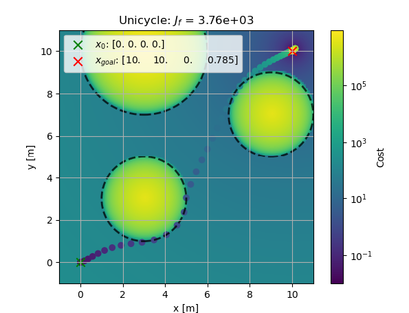
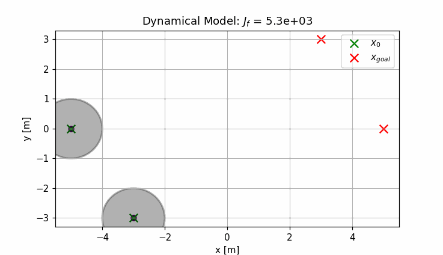

# decentralized

## Overview
Repository containing code for a decentralized implementation of iLQR applied 
in a game theoretic context. While the project is still relatively new and we
are working to implement new features, it currently supports a centralized
multi-agent planner but has trouble overcoming deadlock.



## Features
* Simulation of arbitrary state space models in concert with each other.
* Incorporation of various notions of cost such as goal trajectories, obstacles,
  and coupling between agents.
* Framework for solving navigational optimal control problems with LQR and iLQR
  in a multi-agent environment using a centralized potential iLQR planner.



## Running the Code
There are a few different python packages that this project relies on listed
out in the next section. For convenience, there's also an
[environment.yml](environment.yml) file that one can use to spin up a conda 
environment with all of the necessary dependencies including `jupyter` and 
`jupyterlab`. To create an environment from this file, execute the following:
```
conda create --file environment.yml
```

If using `pip` with a different environment manager such as `venv`, run:
```
python3 -m venv decctrl
source decctrl/bin/activate
pip install numpy scipy matplotlib sympy jupyter jupyterlab
deactivate # when finished
```

[notebooks/main.ipynb](notebooks/main.ipynb) is the top level script used to
construct the system dynamics and conduct simulations. 
[notebooks/derivations.ipynb](notebooks/derivations.ipynb) is where many of the
analytical linearizations and quadraticizations originated from.

## Dependencies
**Required**:
* `numpy`
* `scipy`
* `matplotlib`

**Recommended**:
* `sympy`
* `jupyter`
* `jupyterlab`

## Credit
The following two repositories have been instrumental from both an algorithms
and software architecture perspective in the development of this project:
* [HJReachability/ilqgames](https://github.com/HJReachability/ilqgames)
* [anassinator/ilqr](https://github.com/anassinator/ilqr)