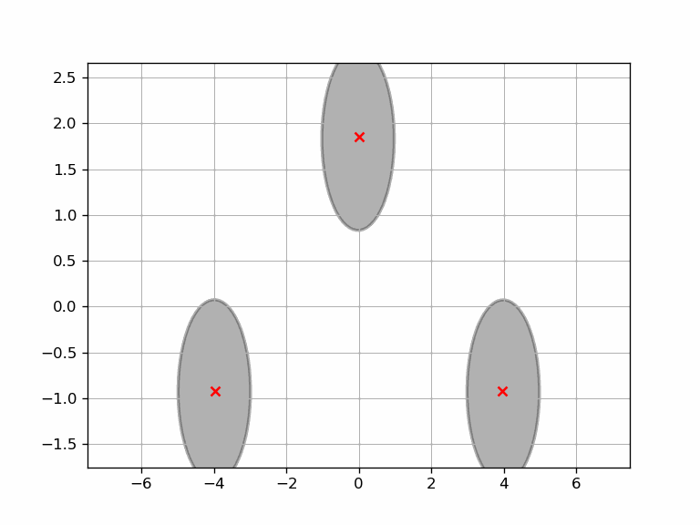

# decentralized

## Overview
Repository containing code for a decentralized implementation of iLQR applied 
in a game theoretic context. While the project is still relatively new and we
are working to implement new features, it currently supports a centralized
multi-agent planner that can be tuned to achieve realistic trajectories. 

## Features
* Simulation of arbitrary state space models in concert with each other.
* Incorporation of various notions of cost such as goal trajectories, obstacles,
  and coupling between agents.
* Framework for solving navigational optimal control problems with LQR and iLQR
  in a multi-agent environment using a centralized potential iLQR planner.

## Running the Code
To run the code, we assume that you have [decentralized](decentralized/) on 
your `PYTHONPATH` environment variable. On unix, this can be accomplished by:

    export PYTHONPATH=${PYTHONPATH}:/absolute/path/to/decentralized/

Additionally, you must compile the C++ extensions using Cython by running:

    python setup.py build_ext --inplace

This should create a `bbdynamicswrap.cpp` as well as a `*.so` file that
`decentralized` will automatically include in the package namespace.

### Environment
There are a few different python packages that this project relies on listed
out in the next section. For convenience, there's also an
[pyproejct.toml](pyproject.toml) file that one can use to spin up a poetry 
environment with all of the necessary dependencies. To create an environment 
from this file, execute the following:

    poetry install

See the following for more information:

- [Installation](https://python-poetry.org/docs/#installation)
- [Initialize a pre-existing project](https://python-poetry.org/docs/basic-usage/#initialising-a-pre-existing-project)

### Organization
- [notebooks/main.ipynb](notebooks/main.ipynb) is the top level script used to
  construct the system dynamics and conduct simulations. 
- [notebooks/derivations.ipynb](notebooks/derivations.ipynb) is where many of
  the analytical linearizations and quadraticizations originated from.

## Credit
The following two repositories have been instrumental from both an algorithms
and software architecture perspective in the development of this project:
- [HJReachability/ilqgames](https://github.com/HJReachability/ilqgames)
- [anassinator/ilqr](https://github.com/anassinator/ilqr)
